# M0 Report: Foundation and UI kit

**Status:** every M0 task is built. CI is green on GitHub. The web build cannot be deployed yet,
because GitHub Pages is not enabled on this private repository (question 1). Work is stopped here
until the Owner's verdict.

Claims are **Verified** only where the command that proved them is named. Commands run from the
repository root after `godot --headless --path . --import`.

## How to look at it

- **Web build (PC and phone):** once Pages is on and this branch is merged, CI deploys it to
  `https://mapsugui.github.io/starfire_hearth_v2/` (**Unverified** until then).
- **Before that:** every CI run on the pull request uploads a `web-build` artifact. Unzip it and
  serve the folder, for example with `python3 -m http.server`, then open `http://localhost:8000`.
  A browser cannot run it straight from disk.
- **Desktop builds:** every CI run on `main` uploads `windows-build` and `linux-build` artifacts.
  So does Actions > CI > Run workflow, which GitHub offers once the workflow is on `main`.

Things to try:
- On PC, hover a number for its breakdown and click to pin it. On a phone, tap a number or
  long-press any icon.
- Lines with an arrow open a second breakdown.
- Use Text 100/150/200%, High contrast, and "Phone layout" (which simulates the phone on a PC).
- Open the dialog, drawer, bottom sheet and notices.
- On a phone, open "More" in the top bar.
- Visit the Icons and Stars and planets pages.

## What was built

| Brief task (§12, M0) | Where |
| --- | --- |
| Repository bootstrap (§0.2) | `.godot-version` (4.7.2-stable), `project.godot`, `.gitignore`, `.gitattributes`, `LICENSE`, `README.md`, `CHANGELOG.md`, `CREDITS.md`, `docs/DESIGN_LOG.md`, IBM Plex Sans and Mono with OFL files |
| CI (§9.10) | `.github/workflows/ci.yml`, `.github/actions/setup-godot` (cached editor and templates), `export_presets.cfg` |
| GameState and its serialization | `sim/core/*`: integer-only state, `to_dict`/`from_dict`. `sim/save/*`: canonical JSON, SHA-256 hash, save envelope with checksum and migration chain |
| Rng with test vectors | `sim/rng.gd`, `sim/rng_stream.gd`: xoshiro128**, stateless seeded streams. `tests/golden/rng_vectors.json` comes from an independent reference implementation |
| Command and Result | `sim/commands/*`: registry, queue with undo, two real commands (rename a colony, reorder job priorities) |
| TurnProcessor with the empty phases | `sim/turn/turn_processor.gd`: the 14 phases of §9.4 in order. `report_builder.gd` picks the top 3 |
| Breakdown and ReportItem | `sim/explain/*`: the lines always sum exactly to the total. Also `WhyLog` |
| Test runner and boundary scan | `tests/run_tests.gd`: a script error fails the test that raised it. `tests/unit/test_boundary.gd` |
| validate_data.gd with all the data stubs | `tools/validate_data.gd`, `tools/data_checks.gd`. Every `data/` file of §9.2 exists (see "Deviations" for which are real) |
| Theme tokens, fonts | `ui/theme/tokens.gd` (§8.2 palette, high contrast), `ui/theme/theme_builder.gd` (text 100 to 200%, compact, touch) |
| Components | `ui/components/`: see the note below this table |
| Responsive layout helper | `app/layout.gd`: 1080p-relative scale on PC, dp on touch, compact class, safe areas |
| Icon family, contact sheet | 87 icons in `assets/icons/`, filled and outlined. `tools/icon_sheet.gd` |
| Star and planet generators | `ui/map/star_disc.gd` (spectral class, magnitude, binaries), `ui/map/planet_disc.gd` (8 types, seeded surfaces, rings, belts) |
| Screenshot tour and id audit | `tools/screenshot_tour.gd`, `tools/id_audit.gd` |
| Showcase at both sizes and text scales | `ui/screens/showcase/`: the main scene of the M0 build |

Components: `Explainable` (nested to two levels), `BreakdownTooltip`, `ResourceChip`, `Card`,
`Modal`, `Toast`, `Drawer`, `BottomSheet`, `SfTabs` and `HexCell`. There are seven button
variants: primary, secondary, ghost, danger, icon, tab and link. Also `TopBar`, `Meter` and
`NoiseWave`.

Also built:
- `tools/bot_run.gd` and `tools/telemetry_report.gd`: the bot smoke test and the gates.
- `tools/palette_report.gd`: contrast and colour-blind separation.
- `tools/web_smoke.mjs`: the exported web build in a real browser.

## Gate results

| Check | Command | Result |
| --- | --- | --- |
| Data valid | `godot --headless --path . -s tools/validate_data.gd` | **Verified:** 18 tables, 47 records, 415 strings, 0 errors, 1 SKIP (reachability, until a scenario is playable) |
| Tests | `godot --headless --path . -s tests/run_tests.gd` | **Verified:** 85 passed, 0 failed, 390 checks in 17 files, 1.8 s |
| Bot smoke | `godot --headless --path . -s tools/bot_run.gd -- --scenario s1 --policy balanced --seeds 1-3 --turns 60 --out telemetry --check-determinism`, and the same with `--policy random-legal` | **Verified:** 360 turns, 0 invariant problems, every run replayed to the same hashes |
| Telemetry gates | `godot --headless --path . -s tools/telemetry_report.gd -- --in telemetry` | **Verified:** PASS invariants, PASS determinism (6 of 6), PASS end-turn p95 1.48 ms (budget 300 ms). The 5 balance gates SKIP until M1 |
| Screens and audit | `xvfb-run -a -s "-screen 0 2560x1600x24" godot --rendering-driver opengl3 --path . -s tools/screenshot_tour.gd -- --out screens/` | **Verified:** 68 screenshots (17 states x PC and phone x 100% and 200% text), 0 audit issues, 102 exemptions (the three text-size buttons in each of the 34 PC renders), 34 s |
| Icon sheet | `xvfb-run -a godot --rendering-driver opengl3 --path . -s tools/icon_sheet.gd -- --out screens/icon_sheet.png` | **Verified:** 1680x2346 PNG |
| Contrast | `godot --headless --path . -s tools/palette_report.gd` | **Verified:** every text colour is at least 4.56:1 on every panel colour (AA needs 4.5:1) |
| Exports | `godot --headless --path . --export-release "Web" build/web/index.html` (also `"Windows"`, `"Linux"`) | **Verified:** all three exit 0 |
| Linux build runs | `xvfb-run -a ./build/linux/StarfireHearth.x86_64 --rendering-driver opengl3 --quit-after 240` | **Verified:** exit 0, no script errors. The Windows build has not been run: **Unverified** |
| Web build runs | `node tools/web_smoke.mjs --build build/web --out screens/web` | **Verified:** 3 of 3 devices pass. PC gets "wide, pointer"; Android phone (873x393 at 2.75x) and iPad get "compact, touch". Each boots in under 2 s with software WebGL |
| CI green on GitHub | [run 35977347923](https://github.com/mapsugui/starfire_hearth_v2/actions/runs/35977347923) on commit `067987d` | **Verified:** all three jobs passed. On the runner: 85 tests passed; 68 screenshots with 0 audit issues; web smoke test 3 of 3; end-turn p95 2.06 ms |
| Web build deployed | Pages deploy job, on `main` | **Not done:** Pages is off (question 1) |
| Look approved | Owner playtest on PC and phone | Waiting for you |

### Performance budgets (§9.11)

| Budget | Result |
| --- | --- |
| End turn under 300 ms, desktop | **Verified**, but only for the empty phase skeleton on the stub Scenario 1: p95 1.48 ms (telemetry report). The real test starts with M1's playable scenario |
| End turn under 1 s, phone | **Unverified** (no device) |
| Map at 60 fps | No map until M1 |
| Memory under 400 MB | **Verified** for the showcase: peak resident memory is 294 MiB in the Linux build under xvfb, from `VmHWM` in `/proc/<pid>/status` while it ran 900 frames. Software OpenGL keeps what would be GPU memory in the process, so this overstates real use |
| Web build under 40 MB | **Verified:** 11.0 MB as a compressed download (gzip -9 of each file, 11,015,704 bytes); 40.8 MB on disk (40,795,000 bytes). Which reading counts: question 3 |

## Screenshots

These come from real renders: the tour under xvfb with OpenGL 3, and the web build in headless
Chromium. The full set of 68 is in the `screens` artifact of each CI run.

| | |
| --- | --- |
|  PC, 100%: the components page | 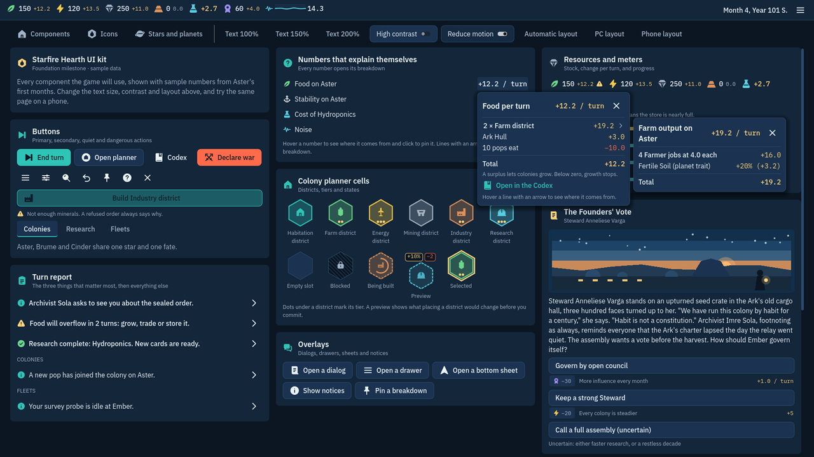 PC: food breakdown pinned, with its Farm line's breakdown open beside it |
| 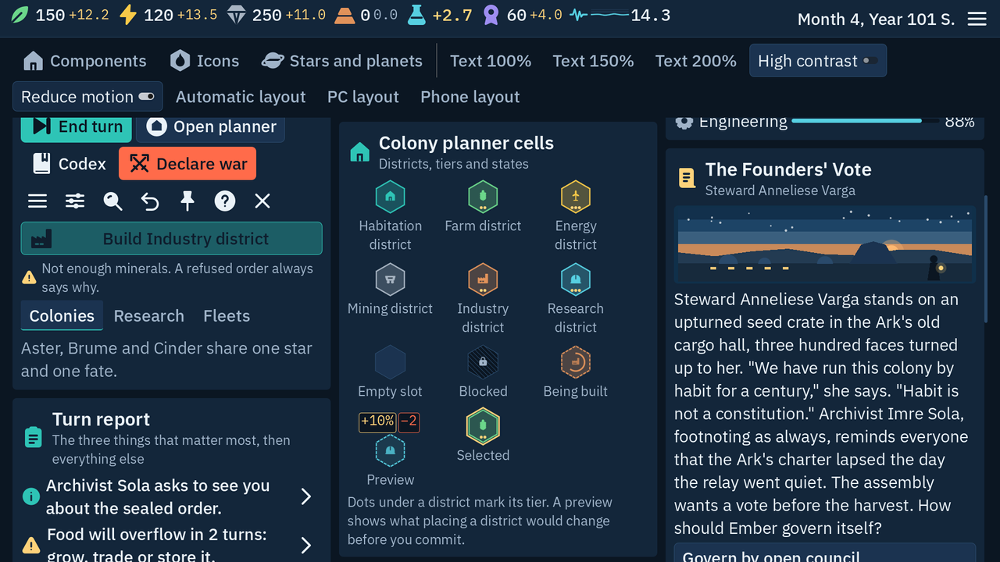 PC, 200% text | 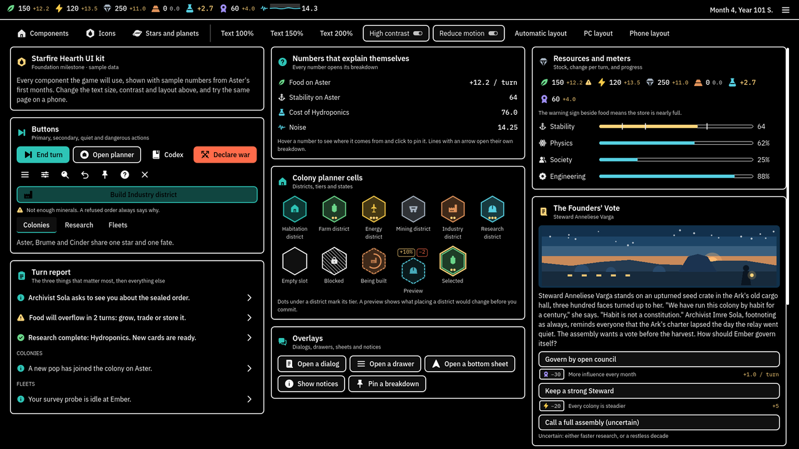 PC, high contrast |
| 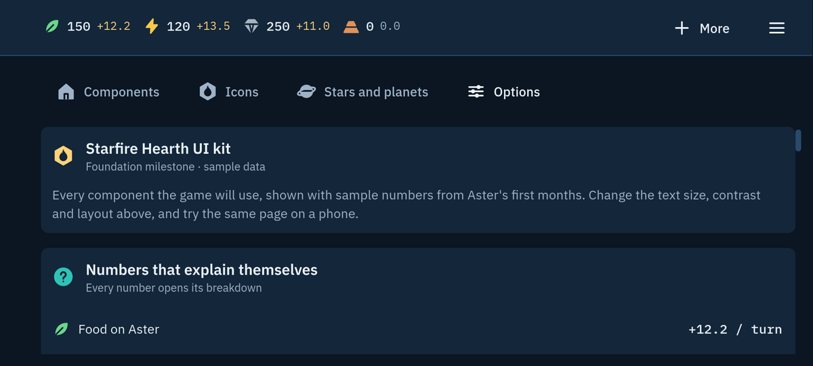 Phone (873x393 dp): compact top bar with "More" | 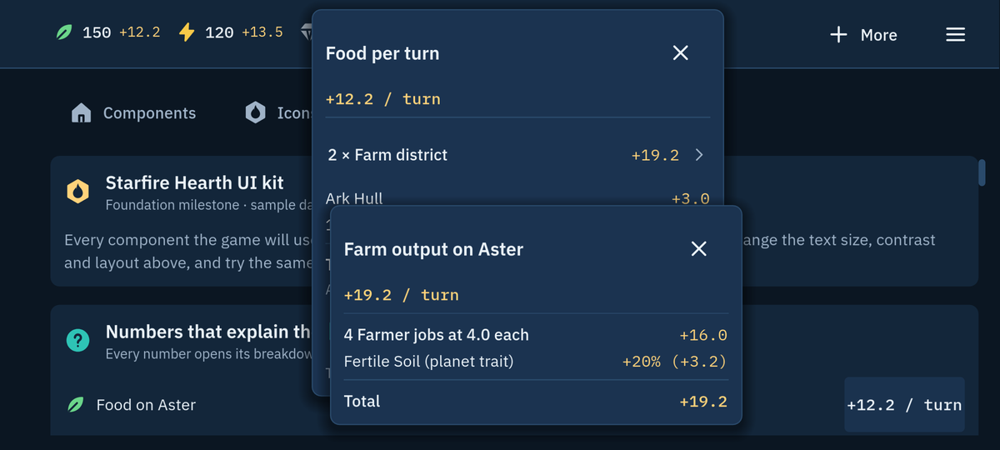 Phone: tapped number, breakdowns stacked in the centre |
| 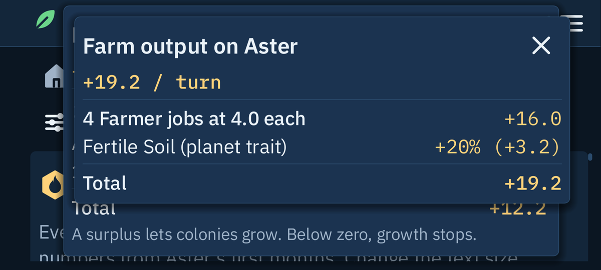 Phone, 200% text: nested breakdown | 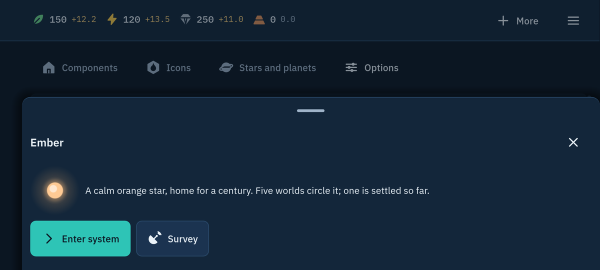 Phone: bottom sheet |
| 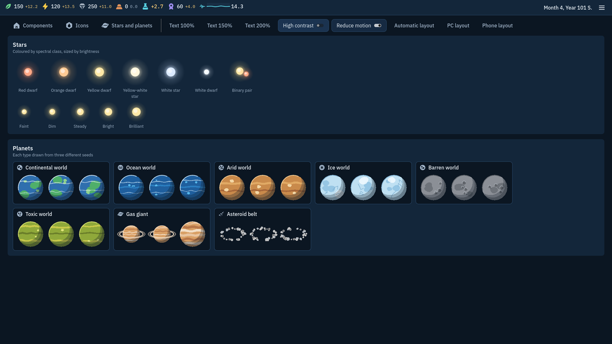 Star classes and the eight planet types | 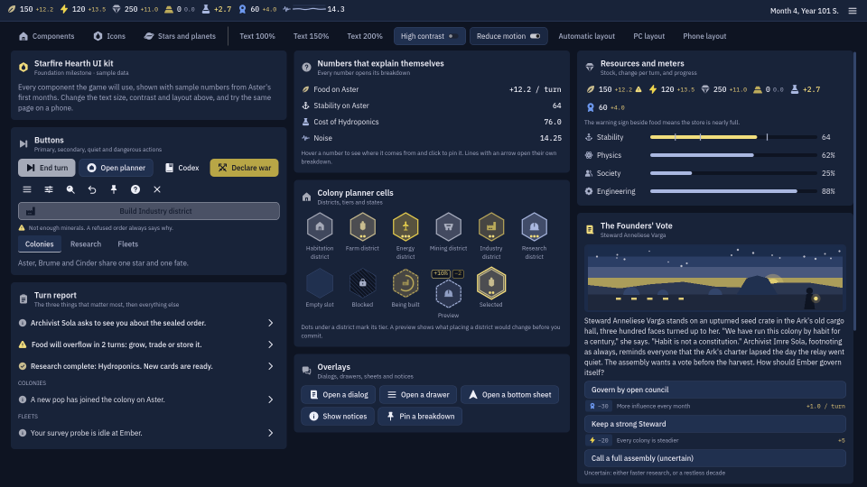 The PC overview under a deuteranopia simulation |
| 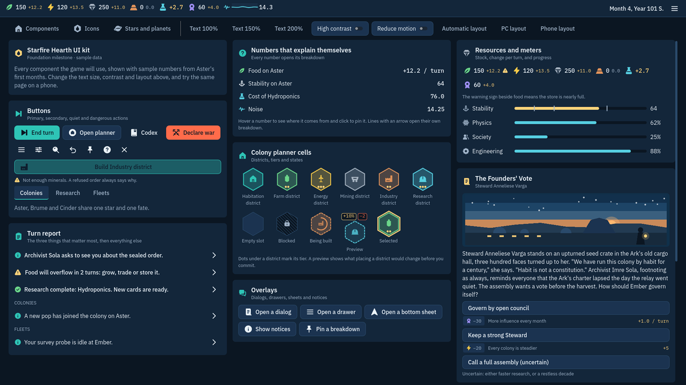 The exported web build in Chromium, 1920x1080 | 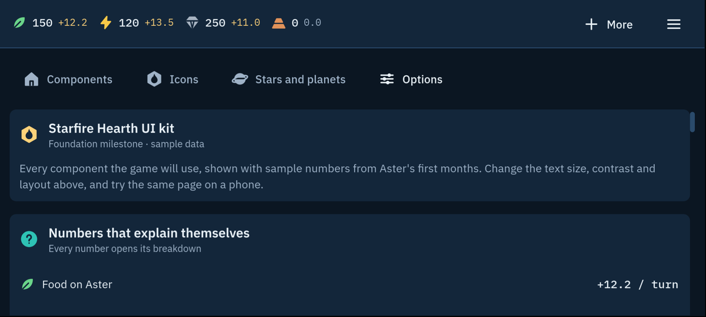 The web build as an Android phone |
| 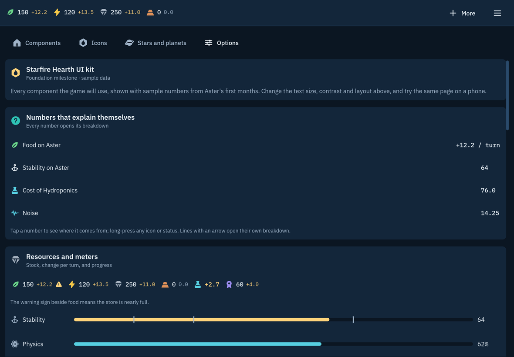 The web build as an iPad | 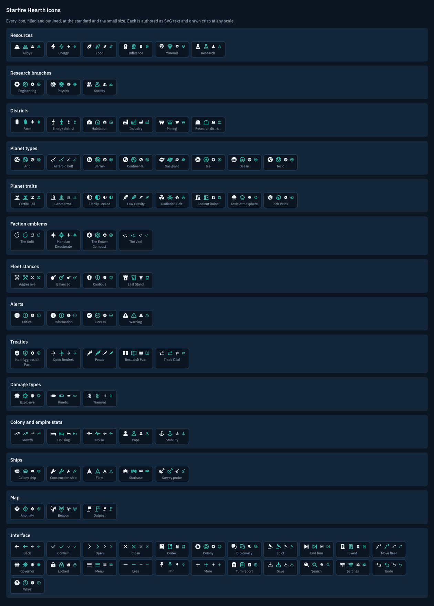 The icon contact sheet |

What I checked in the screenshots, across all 68 and the web captures:
- Text is never cut off, overlapping or broken mid-word. This is also audited.
- Every number shows an Explainable affordance.
- Nested breakdowns are placed and sized sensibly at both text sizes. At 200% on the phone the
  source column had wrapped to a word per line; this is fixed (DESIGN_LOG 40).
- Touch targets are at least 48 dp. The top bar fits the phone at 200%.
- Icons scale with the text.
- High contrast really is black and white with outlines.
- Overlays have backdrops and sit inside the safe area.
- Star and planet art reads at a glance.
- The deuteranopia copies keep positive and negative apart. The sign always does this too, and
  an icon does wherever there is room.
- The web build picks the right layout on each device, and in phone portrait, which the game
  does not target (§14), it still reflows cleanly.

## Known issues

- **The web build is not deployed** (question 1). CI's deploy job is ready and runs on `main`.
- **Colour-blind separation** (`tools/palette_report.gd`, ΔE under deuteranopia; below 20 is easy
  to confuse):
  - farm vs industry districts: 19.9
  - your teal vs science cyan: 15.8
  - mineral slate vs secondary text: 4.7
  - positive gold vs negative ember: 20.2, borderline (question 2)

  Colour is never the only signal: districts have icons, and numbers have signs.
- **Balance gates SKIP** until M1 gives a playable scenario (DESIGN_LOG 29). The M0 bot plays the
  empty phases, so it proves determinism and speed, not fun.
- **Unverified until a device is available:** the Windows build, phone performance, and touch on a
  real phone. The browser test emulates touch.
- **Tablets get the phone layout**, because an iPad is 1180 dp wide, under the 1280 threshold.
  Tablets are not a §7 target.
- **Headless runs print "resources still in use at exit"**, an engine quirk (DESIGN_LOG 24) that
  does not affect results.
- **In the planner card, the "Preview" cell's caption sits lower** than its neighbours, because
  its change chips add height. This is cosmetic.
- **Showcase numbers are sample content** (DESIGN_LOG 30). "Open in the Codex" does nothing yet;
  the Codex arrives with its screen.
- **Unverified until deployed:** whether Pages serves the web build compressed.
- **Node 20 warning in CI:** GitHub warns that `actions/cache@v4`, `actions/checkout@v4` and
  `actions/upload-artifact@v4` target Node 20. It already runs them on Node 24, and they work.
  They should move to their Node 24 releases when convenient.

## Deviations from the brief

Each is in `docs/DESIGN_LOG.md`.

- The theme is built at run time from `tokens.gd`, not kept as `theme.tres` (12).
- Two autoloads beyond §9.2: `Layout` and `Overlay` (15).
- The web size budget is read as the download size (37). Question 3.
- One tool is Node, not GDScript: `tools/web_smoke.mjs` (38).
- CI runs on pushes to `main` and on pull requests, rather than on every push (39).
- The screenshot tour visits showcase states until the §7 screens exist (41).
- Against my own M0 plan: techs are an empty stub, not real records. They move to M1 together
  with district tiers, buildings, the Research Institute unlock and tier III (28). The brief's
  M0 asks only for stubs.

## Decisions you can overrule

The reasons are in `docs/DESIGN_LOG.md`:

1. Godot 4.7.2 is pinned.
2. The fonts are IBM Plex Sans 1.1.0 and IBM Plex Mono 2.5.0.
3. The licence is "All rights reserved".
4. Rounding floors toward negative infinity.
5. Units: hundredths for resources, basis points for percentages, integers everywhere.
6. The RNG is seeded by folding (seed, turn, stream, salt).
7. `range(lo, hi)` includes both ends.
8. A custom canonical JSON writer.
9. Iteration follows sorted ids.
10. Import before any headless run.
11. The string table loads at run time.
12. The theme is built at run time.
13. Icons are rasterised at the exact pixel size.
14. The UI scale model: 1080p-relative on PC, dp on touch, compact below 1280x700.
15. Autoloads `Layout` and `Overlay`.
16. The overlay layer carries the theme.
17. The web export is single-threaded.
18. No 2D MSAA.
19. Icons grow with the text.
20. Breakdowns stack on phones and sit side by side on PC.
21. The top bar is a swipeable strip.
22. The test runner uses `Logger`.
23. Tools load UI classes at run time.
24. The exit-message quirk is left visible.
25. The polity is named "The Ember Compact".
26. District colours: Habitation is teal.
27. The trait effect keys `slots_add` and `ship_cost_bp`.
28. Tiers, buildings and techs are deferred to M1.
29. Balance gates SKIP on stubs.
30. Showcase numbers are sample content.
31. Icon names live in the string table.
32. Audit rules for broken words and hex overlap.
33. Numeric-label exemptions.
34. The save version is the schema version.
35. Empty content folders are optional at run time.
36. Phones and tablets are detected from the browser.
37. The web budget is the download size.
38. The web smoke test uses Node.
39. The CI triggers.
40. Breakdowns widen with the text.
41. The tour visits showcase states at M0.

## Questions for the Owner

1. **Where should the playtest build live?** GitHub Pages on a private repository needs a paid
   plan, and the site is public even though the code is not.
   - **(a) Recommended:** with GitHub Pro, turn Pages on (Settings > Pages > Source: GitHub
     Actions), then merge. Nothing else changes.
   - (b) Make the repository public. Pages becomes free and the licence stays "All rights
     reserved".
   - (c) Another host, such as a restricted itch.io page. I add a deploy step with an API key you
     store as a repository secret.
2. **Negative numbers for colour-blind players.** Ember (#FF6B4A) against gold is ΔE 20.2 under
   deuteranopia.
   - **(a) Recommended:** coral pink #FF6F91 for negative numbers only; alerts stay ember. It is
     ΔE 39.1, with contrast 5.81:1 on panels.
   - (b) Rose #FF5C8A: ΔE 40.2, contrast 5.23:1.
   - (c) Keep ember: signs and icons already carry the meaning.

   Violet options separate further but read as the Vael's magenta. Until you answer I keep
   ember, as the brief's palette has it.
3. **Web size budget.** The official web engine alone is 39.5 MB on disk.
   - **(a) Recommended:** measure the download, now 11.0 MB.
   - (b) Measure files on disk. That needs a custom slimmed engine build, against §0.2's official
     templates.
   - (c) Raise the on-disk budget to 50 MB.
4. **Licence:** keep "All rights reserved" (recommended while unreleased), or name the one you want.
5. **The polity name "The Ember Compact":** keep it (recommended), or give me another.
6. **The look (the M0 gate):** do the showcase and the icon sheet read well on your PC and your
   phone? Say what to change about:
   - density at 100% on the phone
   - the palette
   - filled versus outlined icons
   - the hex planner cells

M1 will also settle the two open data questions of the brief: the Research Institute's unlock
(§10.3 note) and how tier III districts unlock (§10.4 note). The M1 plan will state my choice
and you can overrule it.
