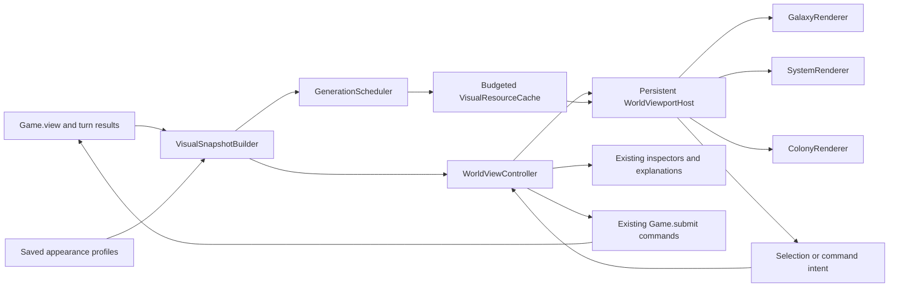

# M1.1 architectural plan: integrated 3D worlds

**Status: Owner approved implementation on 1 October 2026. Stages A, B, C and D are validated
functionally; quality delivery takes priority over temporary performance overruns.**

The Owner requested staged implementation, revalidation and a progress report at
each stage. [Progress](M1_1_PROGRESS.md) and the
[Stage A report](M1_1_STAGE_A_REPORT.md), [Stage B report](M1_1_STAGE_B_REPORT.md),
[Stage C report](M1_1_STAGE_C_REPORT.md) and [Stage D report](M1_1_STAGE_D_REPORT.md) record evidence and open gates.
The scope below remains the approved baseline. On 1 October 2026 the Owner
authorized temporary performance overruns: ship visual quality, then optimize.
Budget numbers remain measured optimization targets and do not block incorporation
or a quality-focused review build. Correctness, intel filtering, save compatibility
and usable controls remain stage gates. Record overruns rather than hiding them;
public deployment, merge, push and tagging still require separate authorization.

M1.1 is a checkpoint of M1's First Light build. It makes the 3D galaxy, system and
colony presentations working parts of the normal game screens, with a richer,
physically grounded sci-fi finish. It is complete when First Light remains playable
from title to debrief through those views, on desktop and a phone browser, and the
Owner has reviewed the checkpoint's art and usability.

Source baseline: existing branch `claude/starfire-hearth-build-cs2vb6`, commit
`a160d9d334c59a2796b8c88e8eaca7f49b42c029`, Godot 4.7.2, Compatibility renderer.
The local incorporation study supplies a reference and reusable code/assets.
Its optional study overlay and provisional material finish are starting points.
No new branch is proposed. After approval, reconcile the reviewed study changes
against the current head of the existing M1 branch before implementing there.
This plan does not authorize a push, merge, tag or deployment.

## 1. Checkpoint scope and player experience

| Area | M1.1 delivered behavior |
| --- | --- |
| Galaxy map | A spatial star field with the actual M1 system positions, permitted labels, selection and lane locks. Known systems open the System view. Unknown systems retain neutral markers and the existing locked explanation. |
| System view | An integrated 3D viewport beside the existing inspector: star overview/close view, seeded planets, belts, actual owned civilian ships and outposts. Survey, colonise and outpost orders use M1's existing commands. |
| Planet focus | The same unique world refines into a close view with coherent geography, material relief, atmosphere/clouds where appropriate, rings where the appearance profile allows, and a selectable owned-colony location. |
| Colony planner | An integrated terrain viewport with canonical slots, actual districts/tiers/buildings, the landed Ark and other landmarks, construction layers, and the existing costs, explanations and queue controls. |
| Progress | Settlement stage, completed district tiers, existing technology unlocks and actual buildings determine visual development. Growth preserves the world's identity and parcel numbering. |
| Accessibility | Pointer, touch and keyboard selection; 100–200% text; high contrast; reduced motion; camera reset; a readable strategic view. |
| Compatibility | Existing M1 saves load; visual profiles travel with saves; deterministic rules and scenario outcomes remain stable. |

The normal Galaxy, System and Colony screens own these views. The top bar,
navigation, tutorial, reports, events, Undo and End Turn remain reachable. The
study-only modal and its “Inspect in 3D” entry points retire when screen integration
is complete. An **Appearance: 3D / Strategic** setting provides the existing light
presentation through the same selection and command model.

Owner-approved addition after Stage F: a separate **View layout: Command /
Immersive** preference. Command keeps the existing information-first composition.
Immersive gives the active Galaxy, System or Colony viewport the screen, with a
compact resource strip and toolbar. Selecting a permitted object opens a dismissible
context inspector; colony management and scene controls open on demand. Dedicated
research/ordinance/market/objective screens remain readable, and returning to a map
restores the chosen layout and session camera. Immersive is fully playable through
the existing selection and command path. It is a presentation of the bounded M1
world, with orbit, pan and zoom; it does not introduce city traffic/economy rules.

Layout is independent of **3D / Strategic** and **Auto / Low / Standard** quality.
Standard renders the larger viewport at full resolution and uses the existing close
mesh/material LODs; low-cost profiles remain selectable on phones. Mode switches
retain the live renderer, camera, selected object and pending orders. The preference
is device-local in `settings.cfg` (with an immediate origin-local browser preference),
defaults to Command when missing/unknown, and
never changes campaign graphics versions, physical identity or simulation hashes.
Strategic/unsupported city views use the readable Command layout while retaining
the player's Immersive preference. Contexts use a side panel on desktop/landscape
and a bottom dock in portrait; panels intercept only their own input area.

This addition is revalidated and reviewed before G. G must exercise both layouts
in the full campaign, navigation/lifecycle stress, exports and actual device runs.

Initial release policy: standard 3D on validated desktop configurations; low-cost
3D on validated phone/browser configurations. Auto selects a conservative profile
using capabilities and measured frame time, with a visible user override. Rendering
failure returns to Strategic with an explanation and preserves the current game.

M1.1 concentrates on presentation and integration. Additional scenarios, combat,
new economics, new progression rules, freely walking around cities, and new
exploration or anomaly mechanics remain later milestones. Decorative detail cannot
create a gameplay claim. Space interactions attach to actual M1 objects and orders.

## 2. What the study proves, and what M1.1 must resolve

The study already connects real Build/Cancel/Survey actions to 3D, preserves
canonical hex positions, filters hidden descriptions, and uses Blender parts and
baked material tiles. Recorded evidence: 170 tests / 3,236 checks, 78 rendered
interaction/layout checks, seventeen captures, and two deterministic playthroughs.
Those results establish a starting point; they do not certify M1.1 or phone speed.

The main gaps are:

1. `GameScreen` rebuilds controls on selection/orders/layout changes. A persistent
   renderer must survive those rebuilds without retaining freed inspector controls.
2. The study recreates system nodes for whole-description changes and waits for
   obsolete worker jobs. Production needs keyed updates and asynchronous retirement.
3. Web exports explicitly set `variant/thread_support=false`. WorkerThreadPool-only
   generation must gain a cooperative main-thread backend.
4. Global planet surfaces and regional terrain currently use different generators.
   A shared field and saved geographic anchor must join them.
5. Kit assemblies, ground, foliage and ship proxies need the agreed texture richness
   and stronger silhouettes. A successful engineering prototype alone is insufficient.
6. Actual browser exports, GPU budgets, touch gestures and real device performance
   need evidence. Phone-sized desktop screenshots verify layout only.
7. The M1 catalog has base slot counts **12, 16, 20, 25, 30**, modified by traits and
   dome-world rules. Tests must use `ColonyRules.slot_count`, covering every actual
   size/type and modifier combination; a few synthetic counts are insufficient.

## 3. Architecture and responsibility boundaries

| Component | Responsibility and contract |
| --- | --- |
| `VisualSnapshotBuilder` | Sole renderer access point to gameplay facts. Copies permitted fields into detached typed descriptions with stable IDs, revisions and disclosure levels. Runs on the main thread. |
| `VisualSession` / `AppearanceProfileStore` | Session epoch, appearance version, per-world seed/profile and colony-region anchors. Owns presentation metadata outside authoritative simulation state. |
| `WorldViewController` | Coordinates view/selection, compares revisions, provides existing inspector models, validates intentions through the existing command path, and restores focus after updates. |
| `WorldViewportHost` | A persistent Control/SubViewport boundary outside disposable inspector content. Owns one active scene, input routing, visibility/suspension and presentation-error fallback. |
| Galaxy/System/Colony renderers | Build and patch their own nodes from descriptions. Emit stable IDs and intents; never read `Game`, live state, content rules or inspector internals. |
| `PlanetFieldGenerator` | Versioned pure global appearance field. Globe maps and regional terrain sample the same elevation/biome/material identity. |
| `RegionTerrainGenerator` | Projects a selected global region into terrain chunks; adds local detail, completed-site grading, decorative access routes and seeded ground cover. |
| `GenerationScheduler` | Priority, cancellation, bounded work, desktop/web backends and stale-result rejection. CPU arrays/images only. |
| `VisualResourceCache` | Shared byte-budgeted CPU/GPU resource ownership, LRU eviction, active-resource pins, generator/material-version invalidation and counters. |
| `ArtCatalog` / building kits | Validated visual mapping from actual type/district/building/hull/faction IDs to authored geometry/materials/LODs. No costs, yields or technology rules. |

`sim/` keeps its rendering boundary. The pure save-envelope utility may accept and
return optional presentation dictionaries, but it never imports UI/app services.
No simulation rules, content balance, golden hashes or gameplay RNG streams change
for the incorporation.

### Scene lifetime and updates

`GameScreen` owns the controller and viewport host independently of `_view_box` and
its rebuildable layout root. The implemented host remains a direct screen child;
view layouts provide disposable mount rectangles and inspector containers. It follows
the intersection of the mount with the scroll region without reparenting or exiting
the scene tree. Ordinary refreshes patch the inspector and description while
preserving camera, focus and loaded art. Responsive relayout updates the mount for
the same host. Stage B's lifecycle tests validate this ownership choice.

Updates split into entity identity, surface profile, completed sites, queue,
placement choice, selected object, lighting and layout. A selection changes the
highlight/inspector. A queue change updates construction. A tier/building change
patches affected assemblies. Terrain generation occurs only when its own inputs
change. Subscriptions use explicit connection/disconnection ownership.

Navigation suspends the outgoing scene. Keep lightweight camera/selection state per
entity in a bounded session map; release inactive geometry under the shared budget.
Opening menus, reports or events suspends camera input. Background scenes stop
rendering/generating while hidden. New game/load/title teardown advances the session
epoch, cancels jobs, invalidates old selections and releases owned resources.

### Snapshot and input contracts

Descriptions include `session_epoch`, viewer/entity IDs, description revision,
disclosure, appearance key, permitted objects and canonical slot IDs. Queues and
placement previews are separate from completed content. Controllers receive existing
Breakdown/report models; renderers receive only the small activity/visual facts they
need. No worker receives a mutable simulation object.

Picking yields an entity or slot ID. The controller verifies that ID still exists
and is permitted in the current revision. Camera input yields no command. Buttons
and placement confirmation issue existing commands through `GameScreen.order` /
`Game.submit`; their existing validation/refusal explanations remain authoritative.
End Turn, Undo, Rush, cancel, upgrade, demolition, colony founding and outpost creation
all refresh through the normal bus. Tutorial anchors remain addressable, including
the planner's replacement for `PlannerGrid`.

## 4. Intel and disclosure

Filtering happens before generating geometry, requesting textures, caching a foreign
description or displaying a tooltip. Renderer visibility is insufficient protection.

| Permission in M1 | Description allowed in M1.1 |
| --- | --- |
| Unknown system | The positional marker/topology already disclosed by M1; neutral visual and “Unknown” label. No hidden spectral appearance, bodies, colonies or fleet details. |
| Known system, unsurveyed planet | Physical/name/orbit information currently disclosed by the M1 System view. Omit traits, blocked layout, resource-site hints and settlement detail. |
| Surveyed planet | The permitted physical details, traits and slot information. This permission does not grant live foreign city or fleet access. |
| Owned settled colony | Current command-preview districts, tiers, buildings, queue, stage and relevant derived own-colony activity. |
| Owned civilian ship/outpost | Current permitted identity, task/target and outpost facts needed by the existing inspector. |
| Foreign colony/fleet | Omitted throughout M1.1 unless an already implemented explicit permission provider supplies a permitted snapshot. No inference from live hidden state. |

The broader brief describes Unknown / Surveyed / Observed and last-visit memory.
M1 supplies known-system and surveyed-planet flags, not a complete historical city
snapshot service. M1.1 establishes the description contract for a later service;
implementing foreign surveillance/history belongs to that later gameplay milestone.
Fixtures must prove that changing hidden foreign state cannot change permitted
descriptions, visuals, generated requests, caches or accessible labels.

## 5. Space rendering and interaction

### Galaxy

Map M1's actual system coordinates and lanes into a legible shallow 3D scene.
Maintain stable picking, labels, locked routes and tutorial behavior. Camera pan/zoom
and subtle layered depth make the backdrop feel spatial. Distant decorative stars
and nebula structure provide atmosphere; inspectable system objects are visually
distinct and also available in a keyboard-accessible list.

Unknown markers stay neutral. M1.1 does not unlock First Light's lanes or add objects
with new rewards. The renderer's filtered description supplies the public map
markers so the scene never reads all hidden systems directly.

### System and focused stars

Show actual planets in orbit order using a composed presentation scale suitable for
selection. Keep that layout stable as surveys or tasks change. Visual animation runs
on a separate clock; it cannot imply ship arrival or turn progression.

Stars use spectral-family materials with convection/granulation, temperature-toned
emission, limb shading and restrained coronal motion. White dwarfs and binary
systems have dedicated visual handling. A binary is the current system's composite
star representation; this creates no additional simulation target. Star selection
shows permitted existing facts such as spectral class, avoiding invented statistics.

Cloud rotation, slow stellar activity, sparse local particles around relevant
structures and visible permitted ship/station activity supply motion. Decorative
particles never masquerade as collectible or sensor contacts. Reduced motion and
Pause stop nonessential effects through one explicit visual clock.

### Planets, ships and outposts

All eight current planet types have distinct representations: six solid types,
gas giants and asteroid belts. Gas giants use banded turbulent atmospheres; belts
use seeded instanced rocks with stable selection areas. Atmosphere/cloud/liquid/ice
choices follow the appearance profile and planet type. Barren worlds avoid an
Earth-like sky or vegetation. Toxic and ice worlds have their own material families.

Overview loads a cheap preview, then refines only visible and focused objects. The
focus surface keeps the same geography at every resolution. Clicking an owned
colony marker opens its Colony view and anchored region; Back restores system focus.

Replace scaled probe proxies with three recognizable civilian hull families:
Survey Probe, Construction Ship and Colony Ship. Render actual owned outposts as
small orbital/belt facilities tied to existing state and inspector actions. Ship
position uses the permitted task/system description, with a neutral home reference
when idle; remove hardcoded Aster assumptions. M1's current rules still decide task
completion. Combat ships and battle scenes remain later work.

## 6. Planet uniqueness and globe-to-city continuity

A versioned `PlanetAppearanceProfile` derives from the existing `art_seed`, stable
planet ID and a separately salted appearance namespace. Duplicate source seeds
must not accidentally produce identical planets. This process never consumes a
gameplay RNG stream. Profile fields define continental coverage, relief, biome
bands, mineral palette, atmosphere, cloud structure, surface wear and allowed rings.

The pure global field samples 3D unit-sphere coordinates to avoid longitude seams.
Layered broad geology, ridged relief, drainage/coastal structure, craters where
appropriate and restrained microdetail produce coherent forms. Materials use those
fields rather than unrelated noise on each LOD. This is appearance generation,
with no new climate/resource simulation.

For a colony, choose a deterministic valid region from bounded candidates, recording
quantized latitude/longitude and heading. A continental settlement favors appropriate
land, an ocean settlement a plausible island/coastal platform, and a dome settlement
its planet's surface. Guarantee a feasible planner footprint with local grading;
visual terrain cannot invalidate an otherwise legal M1 slot.

The regional generator samples the same global field through that anchor's tangent
projection. Macro relief, coastline, biome and dominant materials agree with the
globe; local rocks, erosion detail and vegetation refine that region. A colony marker
on the globe points to this location. Planar scenes extend into terrain/horizon,
without a circular display plate.

Region anchors and physical seeds remain stable when population, technology or
buildings change. Material quality changes refine appearance without moving land,
water, parcels or the colony. Test polar regions, longitude seams, low/high quality,
reload and migration. Visual topology is generated deterministically on CPU; minor
GPU shading differences across devices are acceptable and are not gameplay data.

## 7. City terrain, parcels and development

Use `HexGrid.coords(ColonyRules.slot_count(planet))` for every slot, including trait
changes and halved dome-world counts. Selection, adjacency and placement must agree
with the rules. Natural blocked plots get visible rock/outcrop treatment; they do
not become decorative vacant building sites.

Split the scene into stable regional terrain, completed-site assemblies, queued
construction, placement preview, roads/ground cover, ambient activity and selection
overlays. Chunked terrain uses a detailed core and coarser outer rings, with shared
edge samples and skirts to prevent cracks. It is bounded terrain, not an open world.

Completed sites determine localized grading and vegetation exclusions. Preview and
queued footprints temporarily hide conflicting ground cover; cancel/Undo restore
it. Upgrades replace the affected assembly. Demolition follows M1's immediate
command-preview result. Clearing a site restores a defined prepared-ground finish;
macro geography stays stable. Queues keep future geometry visually separate.

Decorative access routes run over the terrain between built footprints, with obstacle
avoidance outside the build-slot adjacency graph. Isolated outer parcels must remain
visually reachable without changing HexGrid adjacency or inventing road bonuses.
Routes, props and background infrastructure cannot be mistaken for additional paid
districts. The Ark and Archive remain landmark exceptions to normal slot occupancy.

Development uses the actual Settlement/Colony/City stage, tier I/II/III assemblies,
real district function and completed building IDs. Future visual upgrades unlock
only where actual state supplies the corresponding fact. Construction scaffolds
and permitted activity make the scene inhabited; cosmetic vehicles do not model
delivery, production or population movement.

## 8. Artistic finish and Blender pipeline

The finish target is believable materials and lighting with a coherent sci-fi
identity: stone, soil, concrete, ceramics, composites, metal, glass and vegetation
should remain distinguishable at ordinary play distance and hold up at permitted
close view. Color variation alone is insufficient. Bevel highlights, normal detail,
roughness variation, layered soil, restrained weathering, recesses, windows and
functional silhouettes supply the richness.

### Civilization identity

- **Ember / `ark`:** practical modular human construction, repaired panels, warm
  inhabited interiors and equipment with a clear function.
- **Meridian:** ordered human modules, controlled geometry, steel/ceramic surfaces
  and infrastructure reflecting retained technical sophistication.
- **Vael:** biologically plausible alien communal forms, different proportions and
  controlled light signaling consistent with their colonial-organism lore.

M1 exposes faction IDs and human origins, not a general species simulation. Keep
architecture profiles distinct from ownership colors. Unlit uses a safe reclaimed
human fallback if a permitted later description requests it; a full pirate-city
library is outside this checkpoint. First Light's Ember assets receive the complete
playable finish. Meridian/Vael receive distinct reusable design/material/shape
profiles and authored exemplars validated in fixtures, without inventing contact
or foreign-city access in First Light. Their full bespoke libraries follow the
milestones in which those civilizations become playable/visible.

### Asset coverage

Six district functions need readable three-tier silhouettes. All fifteen M1
buildings need meaningful assemblies: Ark Hull, Storehouse, Hydroponics Bay,
Fusion Plant, Foundry, Research Institute, Civic Hall, Park Commons, Clinic,
Spaceport, Planetary Shield, Market Exchange, Archive of Sol, Listening Post and
Habitat Dome. Include three civilian hulls, outpost modules, terrain/ground-cover
sets and planet/star families. Share modules and atlases; each combination does not
require a separate full texture set. Existing delivered art remains in credits and
continues to serve story/portraits/UI where relevant.

### Build flow

1. Retain Blender sources or deterministic build scripts under `tools/art/`, with
   documented Blender version, units, naming, origins and material conventions.
2. Author detailed source meshes; generate export meshes and at least three LODs
   for hero structures/ships. Bake tangent-space normals, AO and material masks.
3. Export GLB with predictable pivots/material slots; use shared tileable ground
   textures and building trim sheets. Keep AO separately controllable to avoid
   double-darkening lighting. Standardize sRGB albedo/emission and linear data maps.
4. Import into Godot with mipmaps and supported desktop/mobile texture compression.
   Audit normal orientation, seams, UV density, scale and minimum readable details.
5. Validate catalog coverage, source provenance, triangle/texture budgets and
   missing mappings. Use an explicit fallback for unsupported IDs with a diagnostic.
6. Capture the same close/overview/lighting comparisons in Godot. Blender preview
   alone is not proof of the shipped game finish.

Art review set: Aster overview and street-scale permitted camera distance; a farm,
industrial site, research district, spaceport and Ark close view; a completed upgrade;
continental, arid, ice, barren and toxic surfaces; gas giant and belt; daytime/dusk;
Ember/Meridian/Vael exemplars; phone quality. Retain these reference captures through
the checkpoint so integration changes cannot silently flatten the approved finish.

## 9. Generation, cache and rendering performance

### Scheduling and browser compatibility

Implement one generation-job contract with two backends. Desktop may use bounded
workers; the current non-threaded web export advances generators in small row/tile/
chunk batches each frame. Generation algorithms expose resumable steps and cancellation
checks. Avoid doing an entire high-resolution bake inside one browser frame.

Priorities: selected/focused object, visible overview, visible terrain core, outer
terrain. Maintain at most two CPU generation jobs on desktop and one cooperative
active job on web; newer requests coalesce obsolete work. Each result carries
session epoch, entity/appearance revision and request ID. Late results are discarded
before upload. Keep cancellation cleanup asynchronous during navigation; join workers
only at controlled shutdown after cancellation. Scene nodes and GPU resources are
created/updated on the main thread, with a capped upload/assembly workload per frame.

Cache keys include generator version, appearance seed/profile, representation,
resolution/LOD, material version and region anchor. Slot/completed-site revisions
affect graded region data, not global planet surface identity. Track actual or
estimated bytes, not just item counts. Pin active assets; evict unpinned LRU entries
and transient CPU bake data after upload. Stop prefetching when the budget is tight.
Persistent disk caching is optional later optimization; portable profiles provide
identity without requiring cached images to travel with saves.

### Proposed budgets to validate early

The measured optimization targets remain **compressed web download <150 MB**, **memory
<400 MB**, and **desktop end-turn p95 <300 ms**. Temporary overruns are authorized
for quality delivery; report them and optimize afterwards. M1's report measured 48.2 MB for its
compressed download and 44 ms desktop end-turn p95; those are historical baseline
results and will be remeasured. Incremental visual asset download target: <=25 MB.

| Metric | Desktop standard target | Low phone/browser target |
| --- | --- | --- |
| Active view motion | 60 fps; frame-time p95 <=16.7 ms | 30 fps; frame-time p95 <=33.3 ms |
| Visible geometry | <=300,000 triangles | <=90,000 triangles |
| Draw calls | <=180 | <=100 |
| Planet focused map width | 1024; 2048 optional after measurement | 512; 1024 only if budget permits |
| Planet texture cache estimate | <=48 MiB | <=16 MiB |
| Incremental renderer resource estimate | <=96 MiB | <=48 MiB |
| Cooperative generation slice | <=2 ms when this backend is used | <=2 ms |
| First usable preview after opening a warm session | <=300 ms | <=500 ms |

The texture-cache estimate is part of the renderer-resource allowance. Report CPU
and GPU estimates separately, plus measured process/wasm memory; estimates are not
GPU measurements. Track the existing <400 MB target with a documented measurement
method; temporary overruns are authorized for quality delivery. Post-preview
refinement may take longer and must remain cancellable.
Measure cold boot, first focus, repeat focus and largest legitimate colony separately.

Profile controls reduce viewport render scale, shadows, cloud layers, terrain LOD,
foliage density and map resolution while retaining identity, picking and readable
materials. Prefer instancing, shared meshes/materials, baked detail, one key light,
bounded shadows and restrained transparency. Idle scenes can render on demand;
continuous effects pause when hidden or reduced motion is active. Heavy refinement
is deprioritized around End Turn so renderer work does not consume its latency budget.

Reference validation: desktop Chromium plus native Windows/Linux Compatibility;
actual mid-range Android Chrome and iOS Safari hardware. Browser emulation is useful
for layout and functional CI, and is reported separately from hardware performance.
If a physical device cannot be measured, record its performance evidence as pending
and carry that work into optimization. A desktop screenshot or software-GL frame
rate does not establish physical-device performance.

## 10. Controls, layout and accessibility

Wide screens use a viewport with a persistent inspector beside it. Compact layouts
give the viewport a bounded height and stack scrollable inspector/commands below.
Maintain safe areas, 48 dp touch / 32 px pointer controls, and the existing readable
navigation/top bar. At 200% text, important commands stay reachable without overlap.

Pointer: click selects, drag orbits/pans after a movement threshold, wheel zooms;
drag release cannot accidentally build or select a hidden object. Touch: tap selects,
drag moves the camera, pinch zooms, explicit +/- and Reset remain available. Route
gestures to the viewport only while they start in its bounds; outer UI scroll and
inspector input retain their normal behavior.

Keyboard users can traverse the permitted object/slot list, select, focus, reset
and zoom without ray picking. Retain accessible names and focus order when panels
refresh. The inspector is the complete action alternative to manipulating 3D.
High contrast uses outlines/patterns and labels. Queued, valid and invalid placement
use distinct labels/patterns in addition to blue/green/red. Refusals have text reasons.
Reduced motion stops camera easing and nonessential water/cloud/corona/traffic
animation while preserving selection feedback and construction information.

Settings persist in `user://settings.cfg`: Appearance, quality Auto/Low/Standard,
visual motion and existing accessibility options. Camera and presentation settings
do not enter simulation state or the save-state hash. Player-facing descriptions
explain visual quality in familiar terms; technical counters remain developer tools.

## 11. Saves, appearance versions and compatibility

Keep `GameState` schema 2 and its existing checksum/golden state hashes. Extend the
save **envelope** with optional, separately versioned/checksummed `presentation`
metadata. The pure serializer handles dictionary transport and integrity; app-level
profile code interprets and migrates it. Store generator/profile version, appearance
identity and quantized region anchors. Do not store generated textures/meshes or
camera settings in gameplay state.

M1 saves lacking this section get a deterministic M1.1 profile and anchor from
their existing IDs/seeds. New saves retain those choices across reload and devices.
New colony profiles/anchors derive from the successfully updated game state; merely
hovering or previewing a command cannot create a committed colony location.

Missing/invalid optional visual metadata leaves a valid gameplay save loadable and
reconstructs its appearance with a diagnostic. Unsupported future versions get an
explicit compatibility fallback; they never silently corrupt the gameplay checksum.
Maintain a version dispatch/migration policy for future visual-generator changes,
with fixtures preserving region identity. Older M1 ignores the extra envelope field
and can read the unchanged state, with that behavior verified against the pinned
baseline loader. Saving again in older M1 may discard the appearance metadata.
Save thumbnails capture the current integrated screen without delaying turn resolution
or serializing hidden scene details.

## 12. Proposed file organization and changes

| Location | Planned work |
| --- | --- |
| `ui/screens/game/game_screen.gd` | Persistent host/controller lifetime, mounts, focus restoration, tutorial anchors and command-intent routing. |
| `ui/screens/game/{galaxy,system,colony}_view.gd` | Integrated viewport layouts and shared inspector sections; Strategic alternative; retire study entry buttons. |
| `ui/world/` (new) | Controller, host, descriptions/filter builder, input/camera adapters, quality profiles, three renderers and visual catalog. Consolidate reusable study code here. |
| `ui/world/generation/` (new) | Shared planet field, surface/region jobs, resumable scheduler, deterministic appearance helpers and resource cache. |
| `ui/map/`, `ui/city/` | Reuse/refactor shaders and kits as coherent production modules; eliminate duplicate generators and study dependencies. |
| `app/visual_session.gd` (new), `app/settings.gd` | Appearance/session metadata, settings and lifecycle integration. |
| `app/save_service.gd`, `sim/save/serializer.gd`, flow load paths | Optional presentation envelope, integrity/version handling, backwards compatibility and profile restoration. |
| `assets/3d/`, `assets/textures/`, `tools/art/`, visual catalog data | Authored meshes, LODs, bakes, source scripts/manifests and validators. Gameplay catalogs keep their existing meaning. |
| `strings/en.csv`, settings/help/Codex references | Localized view controls, fallback reasons, accessible names and concise camera help. |
| `tests/`, `tools/`, `.github/workflows/ci.yml` | Functional/intel/save/generation tests, 3D tour, export/web interactions, artifact and performance reports. |
| `project.godot`, export presets, README, credits, design log, milestone report | Version `0.1.1-m1.1`, imports/settings as needed, documented packaging and checkpoint evidence. Keep web single-thread support unless separately justified. |

Path names are proposed; existing study filenames can be migrated during integration.
One well-owned implementation should serve production views and automated tours.
Simulation rules and balance tables are outside the intended change set.

## 13. Implementation sequence and internal gates

| Stage | Deliverable | Gate before proceeding |
| --- | --- | --- |
| A. Baseline and renderer feasibility | Reconcile existing M1 head/study; rerun M1; export a minimal integrated system slice on non-threaded web; instrument memory, jobs and frame time. | Baseline saved and real web generation/commands validated; measured performance debt may carry forward under the Owner's quality-first directive. |
| B. Production foundation | Snapshot contracts/filtering, persistent host/controller, scene lifecycle, scheduler/cache, settings and input. | Hidden-state differential tests pass; stale jobs cannot attach; selections/camera survive ordinary refresh. |
| C. Integrated space | Galaxy navigation, system overview/focus, all planet families, real ships/outposts, standard commands and Strategic alternative. | Full survey/colonise/outpost interaction path works on desktop and web; Unknown remains neutral. |
| D. Shared world geography | Versioned planet field, saved anchors/envelope, region sampling and LOD chunks. | Globe/region continuity, seam/quality/reload tests and old-save compatibility pass. |
| E. Integrated city | Actual slots, tiers, fifteen buildings, landmarks, routes, queue/preview layers and existing planner actions. | Build/Cancel/Rush/Undo/upgrade/demolish match M1 in both presentations; all effective slot counts covered. |
| F. Art and responsive finish | Finished Ember materials/silhouettes, space/terrain/foliage pass, civilian hulls, civilization exemplars, touch/keyboard/accessibility. | Reference captures satisfy the agreed finish and readable controls; asset costs and temporary budget overruns are measured and recorded for optimization. |
| F.1. Command / Immersive layout | Map-first city/space views, on-demand existing inspectors and management, saved layout preference, orbit/pan/zoom and retained scene switching. | Both layouts produce identical gameplay/geography; real canvas and native input paths, save/load, old settings and PC/touch layouts pass; fresh review captures. |
| G. Checkpoint validation | Full First Light playthroughs, CI/export matrix, long navigation sessions and actual device profiling; M1.1 report and review build. | All hard acceptance gates below pass; remaining limitations are named with evidence. |

Art authoring starts during C/D once scales and material conventions stabilize;
final captures happen after integration. The first web feasibility gate comes before
large asset investment. Internal stages are progress markers within M1.1, not new
branches or separately claimed releases. Schedule estimates follow the feasibility
measurements; this plan makes no unsupported calendar promise.

## 14. Validation and acceptance criteria

### Gameplay and data

- Existing M1 unit/integration/golden/save/data/boundary tests stay green, with new
  cases for the contracts being added. No unexplained golden re-baseline.
- Identical command scripts in 3D and Strategic reach identical simulation hashes
  at each turn. All pure camera, quality, lighting, navigation and selection actions
  preserve hashes. Refused orders retain their M1 reason and result.
- Repeat deterministic bot regressions and the existing M1 telemetry gate set;
  report regressions against the pinned baseline without compensating balance edits.
- A human-readable First Light tour goes from title through research/events,
  survey, founding, outpost creation, construction/upgrade, save/load and debrief.
  Commands requiring unlocks are exercised in legitimate progressed fixtures.

### Visibility, generation and lifecycle

- Unknown-system and hidden foreign changes produce no newly disclosed description,
  tooltip, label, asset request or cached city/ship content.
- Same profile/anchor generates stable CPU topology across desktop/web backends and
  quality levels; broad geography agrees in globe and region. Shader pixel differences
  are treated separately from topology and simulation determinism.
- Catalog coverage includes all current planet types, star families, district tiers,
  fifteen buildings and three civilian hulls. Actual effective slot counts and blocked
  combinations agree with HexGrid/rules.
- Repeated view switches, rapid selection/queue changes, load/new game, settings
  changes, cancellation and scene teardown reject stale results and show no growing
  memory/job/node trend across a documented 100-switch stress run.
- Terrain LOD boundaries, picked positions, preview restoration and outer-plot routes
  are inspected in close and overview captures.

### UI, art and platform

- PC and compact/touch layouts pass the existing explanation/id audit at 100% and
  200% text. Keyboard selection and all touch gestures work; viewport actions do not
  swallow inspector scroll or trigger orders accidentally.
- Reduced motion, high contrast, camera reset and the Strategic alternative work
  throughout title-to-debrief flow and after reload/context recovery.
- Scene/shader/generator failure returns to Strategic without losing command state.
  Recoverable GPU context loss suspends work and rebuilds GPU resources from retained
  descriptions after the engine restores the context. If the browser cannot restore
  the engine, the web shell explains recovery through reload and the latest autosave;
  it cannot promise to preserve unsaved orders or display Godot UI without a context.
- Reference renders demonstrate material depth, function and civilization identity
  at play distance and allowed close view. No circular plate. Owner accepts the art
  finish; technical test counts do not replace that assessment.
- Web/Windows/Linux release exports succeed; web smoke actually enters the integrated
  views and exercises selection/commands rather than only booting the title.
- Total size, measured memory, end-turn latency and visual frame time are measured
  against the stated optimization targets. Temporary overruns are authorized for
  quality delivery and must be documented with the subsequent optimization work.
  Actual Android/iOS tests are
  labeled separately from emulation. Missing physical-device evidence stays pending.

Existing verification commands remain: `tests/run_tests.gd`, `tools/validate_data.gd`,
`tools/bot_run.gd`, `tools/telemetry_report.gd`, `tools/screenshot_tour.gd`, and
`tools/web_smoke.mjs`. Extend the study smoke into an integrated M1.1 tour, and add
an art/catalog validator and reproducible performance capture tool. CI artifacts
include logs, before/after images, browser interactions, size reports and job/resource
counters. Frame-rate certification requires representative hardware beyond CI.

## 15. Risks, rollout and checkpoint package

| Risk | Response |
| --- | --- |
| Rich close-up assets exceed web/mobile budgets | Early exported feasibility slice; shared trim sheets, normal bakes, LODs, instancing and conservative Auto quality. Preserve material identity at low quality. |
| Generator redesign moves existing worlds | Versioned saved appearance identity and anchors; generator fixtures; controlled migration policy. |
| M1 refresh frees the renderer or leaves stale handlers | Persistent host outside disposable controls; explicit connection ownership; epoch/revision tokens and stress tests. |
| New visuals disclose hidden game data | Filter before descriptions/jobs; neutral Unknown; owned-only city/fleet policy; hidden-state differential tests. |
| Attractive city obscures strategy or gives false cues | Shared inspector/slot IDs, optional planning overlays and strategic camera; decorative routes have no implied rule effect. |
| Phone layout passes but phone performance fails | Actual device profiling as a checkpoint gate; low profile and Strategic remain selectable; report device limits plainly. |
| Broad art scope delays playable integration | Complete Ember/First Light, use reusable district modules, require distinctive civilization exemplars and defer full foreign libraries with their gameplay milestones. |

After implementation approval, work on the existing M1 branch lineage and keep M1's
prior checkpoint recoverable. Prepare a reviewable diff and distributable checkpoint
artifacts before requesting any separate merge/publication decision. A push to `main`
currently triggers Pages deployment; release preparation must account for that
existing workflow and cannot treat merging as a purely local operation.

The M1.1 review package contains the complete source diff, Web/Windows/Linux builds,
an updated setup/launch guide, architectural decisions, save-compatibility results,
automated checks, performance/device evidence, reference screenshots and a short
title-to-debrief capture. `M1_1_REPORT.md` marks each claim Verified / Pending with
its command or evidence and records any unresolved limitation. After Owner playtest
and checkpoint acceptance, tag/publish/merge only as separately authorized.

## 16. Approval boundary and recommended decision

Approve M1.1 as the scoped checkpoint described here: integrated Galaxy/System/Colony
3D presentation, coherent seeded worlds and city geography, actual M1 commands and
development, a finished Ember/First Light art pass, bounded browser-compatible
generation, the listed compatibility/accessibility gates, and tracked performance
targets with the Owner-authorized temporary overruns.

Approval would authorize implementation on the existing M1 lineage. It would not
authorize additional gameplay systems, new branches, foreign surveillance/history,
full foreign asset libraries, merging, tagging or public deployment. Those require
their own scope or release decision. Any change to a hard budget or acceptance gate
must be reported with measurements and presented for decision before declaring
M1.1 complete, except for the temporary performance overruns already authorized
by the Owner's quality-first instruction.

The planning request originally produced this architectural plan and its review
copies. The previously delivered incorporation prototype remains the study baseline;
implementation progress is recorded separately after approval.

## Source references

- `docs/milestones/M1_PLAN.md` and `M1_REPORT.md`: M1 checkpoint, exports and gates.
- `docs/BUILD_PROMPT.md` sections 4, 5, 7, 9.3, 9.6, 9.11 and 12: canon, UI,
  simulation boundary, saves, budgets and milestone acceptance.
- `app/game.gd`, `app/settings.gd`, `app/save_service.gd`: commands, settings, saves.
- `ui/screens/game/game_screen.gd` and Galaxy/System/Colony views: rebuild/selection
  lifecycle, existing controls and tutorial anchors.
- `sim/core/{planet,empire,game_state}.gd`, `sim/rules/{hex_grid,colony_rules}.gd`,
  `sim/save/serializer.gd`, `data/{planet_types,planet_sizes,factions,buildings,hulls}.json`:
  identity, permitted data, slots, envelopes and real catalogs.
- `export_presets.cfg`, `.github/workflows/ci.yml`, `tools/web_smoke.mjs`: single-thread
  web target, export checks and main-branch deployment trigger.
- `docs/milestones/M1_3D_INCORPORATION.md`, `ui/visual3d/` and the prior gallery/logs:
  verified study, reusable parts and recorded implementation gaps.
